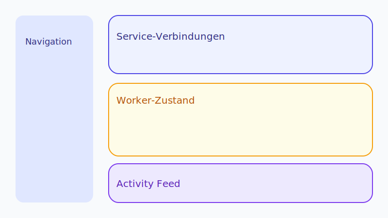
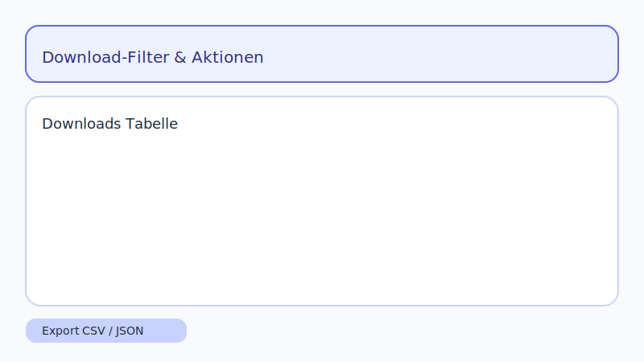
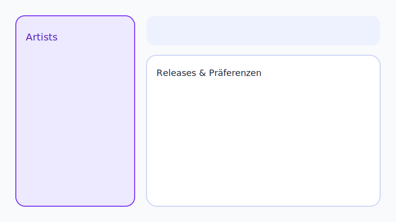
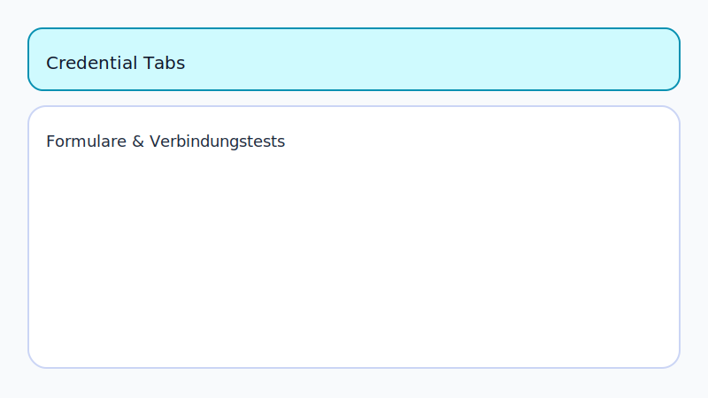
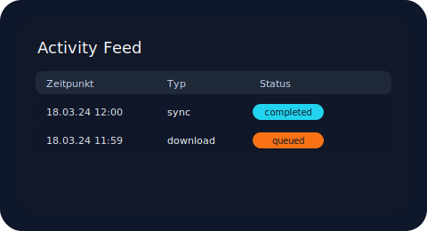
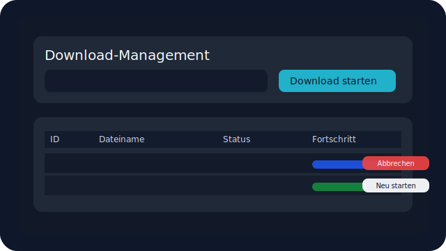

# API-Referenz

Die folgenden Tabellen geben einen Überblick über die wichtigsten REST-Endpunkte des Harmony-Backends. Beispiel-Requests orientieren
sich an den in `app/routers` definierten Routen. Alle Antworten sind JSON-codiert.

## UI-Übersicht

| Seite | Vorschau |
| --- | --- |
| Dashboard |  |
| Downloads |  |
| Artists |  |
| Settings |  |

> **Artists-Filter:** Die Artists-Seite unterstützt Release-Filter für Alben, Singles und EPs. Die Tabelle reagiert unmittelbar auf die Auswahl (Alle, Alben, Singles, EPs).

## System

| Methode | Pfad | Beschreibung |
| --- | --- | --- |
| `GET` | `/status` | Liefert allgemeinen Backend-Status inkl. Worker-Informationen und Credential-Status. |
| `GET` | `/api/health/spotify` | Prüft, ob alle Spotify-Zugangsdaten in der Settings-Tabelle hinterlegt sind. |
| `GET` | `/api/health/plex` | Validiert Plex-Basis-URL und Token in den Settings. |
| `GET` | `/api/health/soulseek` | Kontrolliert die Soulseek-Konfiguration (`SLSKD_URL`, optional `SLSKD_API_KEY`). |
| `GET` | `/api/system/stats` | Systemkennzahlen (CPU, RAM, Speicher, Netzwerk) über `psutil`. |

> **Hinweis:** Soulseek wird ausschließlich über `SLSKD_URL` konfiguriert (z. B. `http://localhost:5030`). Das Backend übernimmt vorhandene Einstellungen automatisch, erwartet für neue Deployments jedoch die URL-Variante.

**Beispiel:**

```http
GET /status HTTP/1.1
```

```json
{
  "status": "ok",
  "version": "1.4.0",
  "uptime_seconds": 12.5,
  "workers": {
    "sync": {"status": "running", "last_seen": "2025-01-01T12:00:00+00:00", "queue_size": 3},
    "matching": {"status": "running", "last_seen": "2025-01-01T12:00:00+00:00", "queue_size": 0},
    "scan": {"status": "stale", "last_seen": "2024-12-31T23:58:00+00:00", "queue_size": "n/a"},
    "playlist": {"status": "running", "last_seen": "2025-01-01T11:59:45+00:00", "queue_size": "n/a"},
    "autosync": {"status": "stopped", "last_seen": null, "queue_size": {"scheduled": 0, "running": 0}}
  },
  "connections": {
    "spotify": "ok",
    "plex": "fail",
    "soulseek": "ok"
  }
}
```

- `status`: Aggregierter Zustand des Workers. `running` signalisiert einen aktiven Heartbeat, `stopped` stammt aus einem kontrollierten Shutdown, `stale` bedeutet, dass länger als 60 s kein Heartbeat eingegangen ist.
- `last_seen`: UTC-Timestamp des letzten Heartbeats (`worker:<name>:last_seen`). Bei unbekanntem Zustand bleibt der Wert `null`.
- `queue_size`: Anzahl offener Aufgaben. Für AutoSync wird zwischen geplanten (`scheduled`) und aktuell laufenden (`running`) Zyklen unterschieden. Worker ohne Queue liefern `"n/a"`.
- `connections`: Aggregierter Credential-Status der externen Dienste (`ok`/`fail`).

**Credential Health-Beispiel:**

```http
GET /api/health/spotify HTTP/1.1
```

```json
{
  "service": "spotify",
  "status": "fail",
  "missing": ["SPOTIFY_CLIENT_SECRET"],
  "optional_missing": []
}
```

- `status = ok`: alle Pflichtfelder sind in der `settings`-Tabelle gefüllt.
- `missing`: Liste der fehlenden Pflichtfelder. Optional fehlende Werte (`optional_missing`) verhindern keinen erfolgreichen Test, werden aber zur Orientierung mitgeliefert.

**Dashboard-Beispiel:**

Im Dashboard erscheinen die Worker-Informationen als farbcodierte Karten. Jede Karte zeigt Name, Status, Queue-Größe und den letzten Heartbeat als relative Zeitangabe:

```text
┌──────────────────────────┐  ┌──────────────────────────┐
│ Sync                     │  │ Autosync                 │
│ ● Running (grün)         │  │ ● Stopped (rot)          │
│ Queue: 3                 │  │ Queue: n/a               │
│ Zuletzt gesehen: vor 30s │  │ Zuletzt gesehen: Keine   │
│                          │  │ Daten                    │
└──────────────────────────┘  └──────────────────────────┘
```

Die neue **Service-Verbindungen**-Karte visualisiert die Credential-Checks mit Emoji-Indikatoren (✅ für erfolgreiche, ❌ für fehlgeschlagene Konfigurationen):

```text
┌──────────────────────────┐
│ Service-Verbindungen     │
│ Spotify      ✅ Verbunden │
│ Plex         ❌ Fehler    │
│ Soulseek     ✅ Verbunden │
└──────────────────────────┘
```

Die Karten aktualisieren sich alle 10 Sekunden automatisch über den `/status`-Endpoint.

## Metadata (`/api/metadata`)

| Methode | Pfad | Beschreibung |
| --- | --- | --- |
| `POST` | `/api/metadata/update` | Startet den Metadaten-Refresh-Worker. |
| `GET` | `/api/metadata/status` | Aktueller Status inkl. Phase, Timestamps und Matching-Queue. |
| `POST` | `/api/metadata/stop` | Fordert einen Abbruch des laufenden Jobs an. |

**Beispiel:**

```http
POST /api/metadata/update HTTP/1.1
```

```json
{
  "message": "Metadata update started",
  "state": {
    "status": "running",
    "phase": "Preparing",
    "processed": 0,
    "matching_queue": 0
  }
}
```

## Sync & Suche (`/api`)

| Methode | Pfad | Beschreibung |
| --- | --- | --- |
| `POST` | `/api/sync` | Startet einen manuellen Playlist-/Bibliotheksabgleich inkl. AutoSyncWorker (liefert `503` + `sync_blocked`, wenn Zugangsdaten fehlen). |
| `POST` | `/api/search` | Führt eine Quell-übergreifende Suche (Spotify/Plex/Soulseek) mit strukturierten Filtern, Normalisierung & Ranking aus. |
| `GET` | `/api/downloads` | Listet Downloads mit `?limit`, `?offset`, optional `?all=true` sowie Status-Filter `?status=queued|running|completed|failed|cancelled`. |
| `GET` | `/api/download/{id}` | Liefert Status, Fortschritt sowie Zeitstempel eines Downloads. |
| `POST` | `/api/download` | Persistiert Downloads und übergibt sie an den Soulseek-Worker (liefert `503` + `download_blocked` ohne Soulseek-Credentials). |
| `PATCH` | `/api/download/{id}/priority` | Setzt die Priorität eines Downloads (höhere Werte werden bevorzugt verarbeitet). |
| `DELETE` | `/api/download/{id}` | Bricht einen laufenden Download ab und markiert ihn als `cancelled`. |
| `POST` | `/api/download/{id}/retry` | Startet einen neuen Transfer für fehlgeschlagene oder abgebrochene Downloads. |
| `GET` | `/api/downloads/export` | Exportiert Downloads als JSON- oder CSV-Datei inkl. optionaler Filter (`status`, `from`, `to`). |
| `GET` | `/api/activity` | Liefert die persistente Activity History (Paging + Filter). |
| `GET` | `/api/activity/export` | Exportiert die Activity History als JSON- oder CSV-Datei inkl. optionaler Filter. |

### Aggregierte Suche (`POST /api/search`)

**Request-Body**

```json
{
  "query": "radiohead",
  "type": "mixed",
  "sources": ["spotify", "plex", "soulseek"],
  "genre": "art rock",
  "year_from": 1990,
  "year_to": 2024,
  "min_bitrate": 320,
  "format_priority": ["FLAC", "ALAC", "AAC"],
  "limit": 25,
  "offset": 0
}
```

- `query` (Pflicht): Freitext, wird vor Verarbeitung beschnitten.
- `type`: `track`, `album`, `artist` oder `mixed` (Default).
- `sources`: Teilmenge von `spotify`, `plex`, `soulseek` (Default: alle Quellen).
- `genre`: Case-insensitive Filter (Diakritika werden ignoriert).
- `year_from` / `year_to`: Inklusive Jahresbereich (`1900`–`2099`).
- `min_bitrate`: Mindestbitrate in kbps (berücksichtigt nur bekannte Werte).
- `format_priority`: Reihenfolge bevorzugter Formate als sekundäre Sortierung.
- `limit`: Anzahl Treffer (Default `25`, maximal `SEARCH_MAX_LIMIT`, standardmäßig `100`).
- `offset`: Startindex fürs Paging (Default `0`).

**Antwortstruktur**

```json
{
  "ok": true,
  "total": 73,
  "limit": 25,
  "offset": 0,
  "items": [
    {
      "type": "track",
      "id": "spotify:track:...",
      "source": "spotify",
      "title": "Weird Fishes/Arpeggi",
      "artist": "Radiohead",
      "album": "In Rainbows",
      "year": 2007,
      "genres": ["Art Rock", "Alternative"],
      "bitrate": null,
      "format": null,
      "score": 0.94,
      "metadata": {
        "raw": {"popularity": 78, "uri": "spotify:track:..."},
        "artists": ["Radiohead"]
      }
    },
    {
      "type": "track",
      "id": "soulseek:file:abcdef",
      "source": "soulseek",
      "title": "Weird Fishes",
      "artist": "Radiohead",
      "album": "In Rainbows (Deluxe)",
      "year": 2007,
      "genres": ["Rock"],
      "bitrate": 320,
      "format": "MP3",
      "score": 0.88,
      "metadata": {
        "raw": {
          "username": "user123",
          "path": "Radiohead/Weird Fishes.mp3",
          "size": 9423921
        }
      }
    }
  ]
}
```

- `ok`: `false`, wenn mindestens eine Quelle nicht verfügbar war (Daten werden trotzdem geliefert).
- `total`: Treffer nach Filtern/Ranking vor Paging (serverseitige Obergrenze `1000`).
- `items`: Normalisierte Treffer mit Score sowie Rohdaten (`metadata.raw`).

**Ranking & Filterung**

- Basisscore: Fuzzy-Relevanz des Matching-Engines.
- Boosts: Format (`FLAC` +0,15, `ALAC` +0,12, `AAC`/`OGG` +0,03), Bitrate (`≥1000` kbps +0,1, `≥320` kbps +0,05, `≥256` kbps +0,02), Typ-Match bei gesetztem `type` (+0,1) sowie Jahr im gewünschten Intervall (+0,05).
- Format-Prioritäten wirken als sekundärer Sortierschlüssel (nach Score, vor Bitrate/Jahr).
- Bitrate-Filter schließen nur Einträge mit bekannter Bitrate < Mindestwert aus; unbekannte Werte bleiben enthalten.
- Genre-Filter nutzen diakritikunabhängige `contains`-Matches.

**Fehlerfälle**

- Validierungsfehler (`422`): z. B. `year_from > year_to` oder ungültiger `type`.
- `DEPENDENCY_ERROR` (`503`): Alle Quellen fehlgeschlagen (Antwort enthält `{ "ok": false, "code": "DEPENDENCY_ERROR", "errors": {"spotify": "timeout"} }`).
- `INTERNAL_ERROR` (`500`): Unerwarteter Serverfehler.


> **Hinweis:** Die in diesem Dokument verwendeten Statusnamen für Activity-Events sind zentral in `app/utils/events.py` hinterlegt und werden von Routern, Workern und Tests gemeinsam genutzt.

> **UI-Tipp:** Die Downloads-Seite bietet einen Button „Alle fehlgeschlagenen neu starten“, der nacheinander `POST /api/download/{id}/retry` für alle fehlgeschlagenen Transfers ausführt.

**Activity Feed / Activity History:**

Unterstützte Query-Parameter:

- `limit` (Default `50`, Maximum `200`): Anzahl der zurückgegebenen Events pro Seite.
- `offset` (Default `0`): Startindex für Paging.
- `type` (optional): Filtert nach Eventtyp (`sync`, `download`, `search`, `metadata`, `worker`).
- `status` (optional): Filtert nach Statuswert (z. B. `ok`, `failed`, `partial`).

Antwortstruktur:

```json
{
  "items": [
    {"timestamp": "2025-03-18T12:15:00Z", "type": "sync", "status": "completed", "details": {"runs": 2}}
  ],
  "total_count": 128
}
```

Event-Felder:

- `timestamp` (`ISO 8601`, UTC, persistent gespeichert)
- `type` (freies Stringfeld, z. B. `sync`, `matching`, `autosync`)
- `status` (Status des Events, z. B. `completed`, `failed`, `queued`)
- `details` (optional, JSON-Objekt mit Zusatzinformationen)

### Detaillierte Sync-/Search-Events

| Status | Beschreibung | Beispiel-Details |
| --- | --- | --- |
| `sync_started` | Beginn eines manuellen oder automatischen Sync-Laufs inkl. Quellen. | `{"mode": "manual", "sources": ["spotify", "plex", "soulseek"]}` |
| `sync_completed` | Abschluss eines Sync-Laufs mit Zählerwerten. | `{"trigger": "scheduled", "sources": ["spotify", "plex", "soulseek", "beets"], "counters": {"tracks_synced": 12, "tracks_skipped": 2, "errors": 1}}` |
| `sync_partial` | Teil-Erfolg bei Sync, enthält Fehlerliste (z. B. pro Quelle). | `{"trigger": "scheduled", "errors": [{"source": "plex", "message": "plex offline"}]}` |
| `autosync_blocked` | AutoSync wurde aufgrund fehlender Spotify/Plex/Soulseek-Credentials übersprungen. | `{"missing": {"spotify": ["SPOTIFY_CLIENT_ID", "SPOTIFY_CLIENT_SECRET"], "plex": ["PLEX_BASE_URL"], "soulseek": ["SLSKD_URL"]}}` |
| `sync_blocked` | Manueller Sync wurde blockiert, weil mindestens eine Quelle keine gültigen Credentials besitzt. | `{"missing": {"plex": ["PLEX_TOKEN"]}}` |
| `spotify_loaded` | Spotify-Daten für AutoSync geladen (Playlists/Saved Tracks). | `{"trigger": "scheduled", "playlists": 4, "tracks": 250, "saved_tracks": 40}` |
| `plex_checked` | Plex-Bibliothek untersucht, Anzahl bekannter Tracks. | `{"trigger": "scheduled", "tracks": 230}` |
| `downloads_requested` | Anzahl fehlender Titel, die Soulseek/Downloads benötigen. | `{"trigger": "scheduled", "count": 18}` |
| `beets_imported` | Ergebnis der Beets-Imports inkl. Erfolgs-/Fehleranzahl. | `{"trigger": "scheduled", "imported": 10, "skipped": 3, "errors": ["quality"]}` |
| `search_started` | Start einer plattformübergreifenden Suche mit Quellen. | `{"query": "Boards of Canada", "sources": ["spotify", "plex"]}` |
| `search_completed` | Trefferanzahl pro Quelle nach erfolgreicher Suche. | `{"query": "Boards of Canada", "matches": {"spotify": 9, "plex": 2}}` |
| `search_failed` | Aufgetretene Fehler während der Suche. | `{"query": "Boards", "errors": [{"source": "plex", "message": "plex offline"}]}` |

### Download-Retry-Events

| Status | Beschreibung | Beispiel-Details |
| --- | --- | --- |
| `download_retry_scheduled` | Automatischer Wiederholungsversuch wurde geplant (inkl. Delay und Versuchszähler). | `{"downloads": [{"download_id": 87, "attempt": 1, "delay_seconds": 5}]}` |
| `download_retry_completed` | Ein zuvor fehlgeschlagener Download wurde erfolgreich erneut eingereiht. | `{"downloads": [{"download_id": 87, "attempts": 2}]}` |
| `download_retry_failed` | Nach allen Wiederholungen endgültig aufgegeben. Enthält Fehlermeldung. | `{"downloads": [{"download_id": 87, "attempts": 3}], "error": "timeout"}` |
| `download_blocked` | Download-Request abgewiesen, da Soulseek nicht konfiguriert ist. | `{"missing": {"soulseek": ["SLSKD_URL"]}}` |

### Worker-Health-Events

| Status | Beschreibung | Beispiel-Details |
| --- | --- | --- |
| `started` | Worker wurde erfolgreich gestartet. | `{"worker": "sync", "timestamp": "2025-03-18T12:05:00Z"}` |
| `stopped` | Kontrollierter Shutdown eines Workers. | `{"worker": "scan", "timestamp": "2025-03-18T12:10:00Z", "reason": "shutdown"}` |
| `stale` | Heartbeat-Schwelle überschritten, Worker gilt als veraltet. | `{"worker": "matching", "timestamp": "2025-03-18T12:12:00Z", "last_seen": "2025-03-18T12:09:45Z", "threshold_seconds": 60, "elapsed_seconds": 135.2}` |
| `restarted` | Worker nach Stopp oder Störung neu gestartet. | `{"worker": "playlist", "timestamp": "2025-03-18T12:13:00Z", "previous_status": "stopped"}` |

**Eventdetails im Activity Feed (Frontend-Beispiel):**

```json
[
  {
    "timestamp": "2025-03-18T12:15:00Z",
    "type": "sync",
    "status": "completed",
    "details": {
      "sources": ["spotify", "plex", "soulseek"],
      "counters": {
        "tracks_synced": 18,
        "tracks_skipped": 4,
        "errors": 1
      },
      "errors": [
        {"source": "plex", "message": "plex offline"}
      ]
    }
  },
  {
    "timestamp": "2025-03-18T12:10:00Z",
    "type": "search",
    "status": "partial",
    "details": {
      "query": "Boards of Canada",
      "matches": {
        "spotify": 12,
        "plex": 3,
        "soulseek": 5
      },
      "errors": [
        {"source": "plex", "message": "plex search timeout"}
      ]
    }
  }
]
```

**Worker-Events im Activity Feed:**

```json
[
  {
    "timestamp": "2025-03-18T12:15:00Z",
    "type": "worker",
    "status": "started",
    "details": {
      "worker": "sync",
      "timestamp": "2025-03-18T12:15:00Z"
    }
  },
  {
    "timestamp": "2025-03-18T12:13:00Z",
    "type": "worker",
    "status": "stale",
    "details": {
      "worker": "matching",
      "timestamp": "2025-03-18T12:13:00Z",
      "last_seen": "2025-03-18T12:11:30Z",
      "threshold_seconds": 60,
      "elapsed_seconds": 90.5
    }
  }
]
```



Das Dashboard zeigt Worker-Events mit farbcodierten Status-Badges (grün = started, grau = stopped, gelb = stale, blau = restarted) und passenden Icons (▶️, ⏹, ⚠️, 🔄). Dadurch lassen sich Health-Änderungen der Worker sofort nachvollziehen.

**Activity-History-Seite (Frontend-Beispiel):**

```text
┌────────────────────────────────────────────────────────────┐
│ Activity History                                           │
│ Typ: [Alle Typen v]  Status: [Alle Stati v]                │
│ ---------------------------------------------------------- │
│ Timestamp           │ Typ      │ Status   │ Details        │
│ 18.03.2025 13:15:42 │ sync     │ completed│ {"runs": 2}    │
│ 18.03.2025 13:14:10 │ download │ failed   │ {"id": 42}    │
│ 18.03.2025 13:13:01 │ worker   │ started  │ {"worker":"sync"}
│ ...                                                      │
│ Seite 1 von 7  [Zurück] [Weiter]                          │
└────────────────────────────────────────────────────────────┘
```

Die dedizierte Seite nutzt dieselben Events aus `/api/activity`, zeigt jedoch die vollständige History mit Paging, Dropdown-Filtern und JSON-Details in einer Tabelle an.

### Activity History Export (`/api/activity/export`)

Der Export-Endpunkt verwendet dieselbe Filterlogik wie `/api/activity`, verzichtet jedoch standardmäßig auf ein Limit und liefert die Ergebnisse vollständig zurück.

Unterstützte Query-Parameter:

- `format` (`json` | `csv`, Standard `json`)
- `type` (optional, filtert nach Event-Typ)
- `status` (optional, filtert nach Status)
- `from` / `to` (optional, Zeitbereich im ISO-8601-Format)
- `limit` (optional, begrenzt die Anzahl exportierter Zeilen)

**JSON-Beispiel:**

```http
GET /api/activity/export?format=json&type=sync&status=completed HTTP/1.1
```

```json
[
  {
    "timestamp": "2025-03-18T12:15:00Z",
    "type": "sync",
    "status": "completed",
    "details": {"runs": 2}
  }
]
```

**CSV-Beispiel:**

```http
GET /api/activity/export?format=csv HTTP/1.1
```

```csv
id,timestamp,type,status,details
17,2025-03-18T12:15:00Z,sync,completed,"{""runs"":2}"
16,2025-03-18T12:10:00Z,download,failed,"{""id"":42}"
```

- `Content-Type: application/json` bei `format=json`
- `Content-Type: text/csv` bei `format=csv`
- CSV-Felder enthalten `details` als JSON-String.

**Frontend-Export (Activity History Seite):**

```text
Filter: Typ = Download | Status = Failed
[ Export JSON ]   [ Export CSV ]

→ erzeugt Dateien im Format activity_history_YYYY-MM-DD.json bzw. .csv
```

Neben diesen Health-Meldungen visualisiert das Dashboard weiterhin Quellen, Kennzahlen (z. B. `tracks_synced`) sowie Trefferzahlen pro Quelle direkt im ActivityFeed-Widget. Fehlerlisten werden rot markiert und als Tooltip hinterlegt.

**Beispiel:**

```http
GET /api/activity?limit=2 HTTP/1.1
```

```json
[
  {
    "timestamp": "2025-03-18T12:05:00Z",
    "type": "autosync",
    "status": "started",
    "details": {"source": "playlist"}
  },
  {
    "timestamp": "2025-03-18T11:57:30Z",
    "type": "matching",
    "status": "batch_saved",
    "details": {"count": 15}
  }
]
```

> **Hinweis:** Ein `POST /api/sync` Durchlauf stößt zusätzlich den neuen AutoSyncWorker an. Dieser prüft Spotify-Playlists und gespeicherte Tracks, lädt fehlende Songs über Soulseek und importiert sie via Beets, bevor Plex-Statistiken aktualisiert werden. Alle Schritte erscheinen im Activity Feed.
>
> Fehlen Spotify-, Plex- oder Soulseek-Zugangsdaten, antwortet der Endpunkt mit `503 Service Unavailable` und signalisiert den Block über das Activity-Event `sync_blocked`:
>
> ```http
> HTTP/1.1 503 Service Unavailable
> Content-Type: application/json
> ```
>
> ```json
> {
>   "detail": {
>     "message": "Sync blocked",
>     "missing": {
>       "spotify": ["SPOTIFY_CLIENT_ID", "SPOTIFY_CLIENT_SECRET", "SPOTIFY_REDIRECT_URI"],
>       "plex": ["PLEX_BASE_URL", "PLEX_TOKEN"],
>       "soulseek": ["SLSKD_URL"]
>     }
>   }
> }
> ```
>
> Das Dashboard zeigt in diesem Fall ein rotes Toast **„Sync blockiert“**, sodass Operator:innen sofort sehen, dass zuerst Credentials hinterlegt werden müssen.

**Download-Beispiel:**

**Download-Übersicht:**

Unterstützte Query-Parameter:

- `limit` (Default `20`, Maximum `100`): Anzahl der zurückgegebenen Downloads.
- `offset` (Default `0`): Startindex für Paging.
- `all` (Default `false`): `true` inkludiert auch abgeschlossene/fehlgeschlagene Einträge.

```http
GET /api/downloads HTTP/1.1
```

```json
{
  "downloads": [
    {
      "id": 42,
      "filename": "Daft Punk - Harder.mp3",
      "status": "queued",
      "progress": 0.0,
      "priority": 3,
      "username": "harmony_user",
      "created_at": "2024-03-18T12:00:00Z",
      "updated_at": "2024-03-18T12:00:00Z"
    }
  ]
}
```

> **Hinweis:** Ohne hinterlegte Soulseek-Credentials beantwortet `POST /api/download` die Anfrage mit `503 Service Unavailable` und liefert das Activity-Event `download_blocked`. Das Frontend blendet dazu ein Toast **„Download blockiert“** ein, damit klar ist, dass zuerst die Soulseek-Anbindung konfiguriert werden muss.

```http
HTTP/1.1 503 Service Unavailable
Content-Type: application/json
```

```json
{
  "detail": {
    "message": "Download blocked",
    "missing": {
      "soulseek": ["SLSKD_URL"]
    }
  }
}
```

**Limitierte Übersicht (z. B. für Widgets):**

```http
GET /api/downloads?limit=5 HTTP/1.1
```

```json
{
  "downloads": [
    {
      "id": 7,
      "filename": "Daft Punk - One More Time.mp3",
      "status": "running",
      "progress": 65.0,
      "priority": 4,
      "username": "club_mode",
      "created_at": "2024-03-18T12:06:00Z",
      "updated_at": "2024-03-18T12:06:10Z"
    }
  ]
}
```

**Alle Downloads inklusive abgeschlossener/fehlgeschlagener Transfers:**

```http
GET /api/downloads?all=true HTTP/1.1
```

```json
{
  "downloads": [
    {
      "id": 42,
      "filename": "Daft Punk - Harder.mp3",
      "status": "completed",
      "progress": 100.0,
      "priority": 1,
      "username": "club_mode",
      "created_at": "2024-03-18T12:00:00Z",
      "updated_at": "2024-03-18T12:05:00Z"
    }
  ]
}
```

**Paging-Beispiel:**

```http
GET /api/downloads?limit=10&offset=10 HTTP/1.1
```

```json
{
  "downloads": [
    {
      "id": 31,
      "filename": "Daft Punk - Voyager.mp3",
      "status": "running",
      "progress": 35.0,
      "created_at": "2024-03-18T12:04:00Z",
      "updated_at": "2024-03-18T12:04:10Z"
    }
  ]
}
```

**Gefiltert nach Status `failed`:**

```http
GET /api/downloads?status=failed HTTP/1.1
```

```json
{
  "downloads": [
    {
      "id": 99,
      "filename": "Massive Attack - Teardrop.mp3",
      "status": "failed",
      "progress": 0.0,
      "priority": 2,
      "username": "trip_hop",
      "created_at": "2024-03-18T11:55:00Z",
      "updated_at": "2024-03-18T12:01:14Z"
    }
  ]
}
```

**Download-Details:**

```http
GET /api/download/42 HTTP/1.1
```

```json
{
  "id": 42,
  "filename": "Daft Punk - Harder.mp3",
  "status": "queued",
  "progress": 0.0,
  "created_at": "2024-03-18T12:00:00Z",
  "updated_at": "2024-03-18T12:05:00Z"
}
```

**Download-Abbruch:**

```http
DELETE /api/download/42 HTTP/1.1
```

```json
{
  "status": "cancelled",
  "download_id": 42
}
```

Harmony ruft bei jedem Abbruch die slskd-TransfersApi (`DELETE /transfers/downloads/{id}`) auf. Erst wenn der Daemon die Anfrage bestätigt, wird der Download in der Datenbank als `cancelled` markiert und der Activity Feed um einen Eintrag `download_cancelled` mit `download_id` und `filename` ergänzt. Sollte der Daemon nicht erreichbar sein, antwortet der Endpunkt mit `502 Bad Gateway` und der Status in der Datenbank bleibt unverändert.

> **Frontend-Beispiel:** Auf der Downloads-Seite steht jetzt pro aktivem Job ein Button **Abbrechen** zur Verfügung. Nach dem Klick ruft das Frontend `DELETE /api/download/{id}` auf, zeigt ein Erfolgstoast an und lädt die Tabelle automatisch neu, sodass der Status in der UI unmittelbar auf „Cancelled“ springt (siehe aktualisierte Abbildung unten).

Die Oberfläche bietet zusätzlich einen Status-Filter (`running`, `queued`, `completed`, `failed`, `cancelled`), eine Suche über Dateinamen und Usernames sowie eine Inline-Eingabe für Prioritäten. Über zwei Buttons lassen sich die aktuell gefilterten Downloads unmittelbar als JSON- oder CSV-Datei exportieren.

**Priorität anpassen:**

```http
PATCH /api/download/42/priority HTTP/1.1
Content-Type: application/json

{ "priority": 8 }
```

```json
{
  "id": 42,
  "filename": "Daft Punk - Harder.mp3",
  "status": "queued",
  "progress": 0.0,
  "priority": 8,
  "username": "club_mode",
  "created_at": "2024-03-18T12:00:00Z",
  "updated_at": "2024-03-18T12:07:00Z"
}
```

Höhere Prioritäten werden vom SyncWorker bevorzugt verarbeitet. Werte größer als die Standardeinstellung `0` sorgen dafür, dass entsprechende Downloads früher in die Soulseek-Queue gelangen – ideal für favorisierte Spotify-Tracks oder manuell dringliche Jobs.

Der Endpunkt synchronisiert die neue Priorität zusätzlich mit allen zugehörigen Worker-Jobs (`worker_jobs`). Liegt der Job noch in der Queue (`queued` oder `retrying`), wird er mit der aktualisierten Priorität erneut eingereiht und beeinflusst damit sofort das Scheduling – inklusive eventuell geplanter Retries. So bleibt die Worker-Priorisierung konsistent mit den in der Datenbank gespeicherten Downloadwerten.

**Download-Start:**

```http
POST /api/download HTTP/1.1
Content-Type: application/json

{
  "username": "dj_user",
  "files": [{"filename": "Daft Punk - Harder.mp3"}]
}
```

```json
{
  "status": "queued",
  "download_id": 42,
  "downloads": [
    {
      "id": 42,
      "filename": "Daft Punk - Harder.mp3",
      "status": "queued",
      "progress": 0.0,
      "priority": 5,
      "username": "dj_user",
      "created_at": "2024-03-18T12:00:00Z",
      "updated_at": "2024-03-18T12:00:00Z"
    }
  ]
}
```

Neue Downloads starten immer im Status `queued`. Über das Feld `request_payload` werden alle Metadaten persistiert, die slskd für den Transfer benötigt (Dateiname, Größe, Peer). Die Worker-Queue verarbeitet die Einträge FIFO und aktualisiert Status & Fortschritt über `SyncWorker.refresh_downloads()`. Spotify-Likes sowie manuell gesetzte Prioritäten sorgen dafür, dass wichtige Transfers mit höherer Priorität schneller eingeplant werden.

**Download-Retry:**

```http
POST /api/download/42/retry HTTP/1.1
```

```json
{
  "status": "queued",
  "download_id": 87
}
```

Der Endpunkt akzeptiert nur Downloads im Status `failed` oder `cancelled`. Vor dem erneuten Start wird der ursprüngliche Job über `TransfersApi.cancel_download` beendet, anschließend werden `username`, `filename` und `filesize` erneut via `TransfersApi.enqueue` eingereiht. Dadurch entsteht ein neuer Download-Datensatz mit eigener ID, der Activity Feed erhält einen Eintrag `download_retried` mit `original_download_id`, `retry_download_id` und `filename`. Wenn slskd nicht erreichbar ist, wird der Vorgang mit `502 Bad Gateway` abgebrochen und kein neuer Datensatz erzeugt.

> **Frontend-Beispiel:** Fehlgeschlagene oder abgebrochene Transfers besitzen den Button **Neu starten**. Nach `POST /api/download/{id}/retry` erscheint der neue Job (inkl. neuer ID) sofort wieder in der Übersicht und im Dashboard-Widget, damit Operatorinnen Retries ohne manuelle API-Aufrufe auslösen können.

**Download-Export (CSV):**

```http
GET /api/downloads/export?format=csv HTTP/1.1
```

```text
HTTP/1.1 200 OK
Content-Type: text/csv

id,filename,status,progress,username,created_at,updated_at
42,"Daft Punk - Harder.mp3",completed,100.0,dj_user,2024-03-18T12:00:00Z,2024-03-18T12:05:00Z
```

Neben `format=csv` ist `format=json` verfügbar. Über die optionalen Parameter `status`, `from` und `to` lassen sich Export-Dateien gezielt einschränken (z. B. nur fehlgeschlagene Downloads der letzten 24 Stunden). Die Downloads-Seite bietet dafür zwei Buttons, die jeweils eine Datei `downloads_<Datum>.json` bzw. `.csv` erzeugen.

## Download-Widget im Dashboard

Das Dashboard zeigt aktive Downloads in einem kompakten Widget an. Die Komponente nutzt `GET /api/downloads` und pollt den Endpunkt alle 15 Sekunden, um Fortschritte automatisch zu aktualisieren. Bei mehr als fünf aktiven Transfers blendet das Widget einen "Alle anzeigen" Button ein, der direkt zur vollständigen Downloads-Ansicht navigiert.

**Beispielansicht:**

```
Aktive Downloads
┌──────────────────────────────┬──────────┬────────────┬─────────────┬──────────────┐
│ Dateiname                    │ Status   │ Priorität  │ Fortschritt │ Aktionen     │
├──────────────────────────────┼──────────┼────────────┼─────────────┼──────────────┤
│ Track One.mp3                │ Running  │ 4          │ 45 %        │ [Abbrechen]  │
│ Track Two.mp3                │ Failed   │ 1          │ 0 %         │ [Neu starten]│
└──────────────────────────────┴──────────┴────────────┴─────────────┴──────────────┘
Alle anzeigen → /downloads
```

**Activity-Beispiel:**

```http
GET /api/activity HTTP/1.1
```

```json
[
  {
    "timestamp": "2024-03-18T12:00:00Z",
    "type": "download",
    "status": "queued",
    "details": {"download_ids": [42], "username": "dj_user"}
  },
  {
    "timestamp": "2024-03-18T11:58:12Z",
    "type": "search",
    "status": "completed",
    "details": {"query": "Daft Punk", "sources": ["plex", "soulseek", "spotify"]}
  }
]
```

### Frontend-Oberfläche



Die neue Downloads-Seite im Harmony-Frontend ermöglicht das Starten von Test-Downloads über eine beliebige Datei- oder Track-ID und zeigt aktive Transfers inklusive Status, Fortschrittsbalken und Erstellungszeitpunkt an. Über Tailwind- und shadcn/ui-Komponenten werden Ladezustände, Leerlaufmeldungen ("Keine Downloads aktiv") sowie Fehler-Toasts konsistent dargestellt. Jeder erfolgreich gestartete Download löst eine Bestätigungsmeldung aus, während fehlgeschlagene Anfragen klar hervorgehoben werden. Pro Zeile stehen nun deutlich sichtbare Buttons zum sofortigen Abbrechen laufender Jobs sowie zum erneuten Start fehlgeschlagener oder abgebrochener Transfers bereit – die UI bestätigt erfolgreiche Aktionen per Toast und aktualisiert die Tabelle automatisch.


Auf dem Dashboard ergänzt das Activity-Feed-Widget die bestehenden Statuskacheln. Es pollt den `/api/activity`-Endpunkt alle zehn Sekunden, sortiert die Einträge nach dem neuesten Zeitstempel und visualisiert die letzten Aktionen mit lokalisierten Typen sowie farbcodierten Status-Badges. Für leere Feeds oder Fehlerfälle erscheinen Toast-Benachrichtigungen, sodass Operatorinnen laufende Sync-, Such- und Download-Aktivitäten ohne manuelle API-Abfragen im Blick behalten.

Das Frontend bietet zusätzlich ein Dropdown zum Filtern nach Event-Typ (`Alle`, `Sync`, `Download`, `Metadata`, `Worker`). Damit lassen sich beispielsweise nur fehlgeschlagene Downloads oder laufende Worker-Events fokussiert betrachten, ohne dass serverseitige Filterparameter nötig sind.

### Artists-Verwaltung

Die Artists-Seite im Frontend nutzt die Spotify-Endpunkte `GET /spotify/artists/followed` und `GET /spotify/artist/{artist_id}/releases`, um eine sortierbare Liste der gefolgten Artists inklusive Coverbildern anzuzeigen. In der Detailspalte lassen sich die verfügbaren Releases mit Jahr, Typ und Track-Anzahl inspizieren. Über einen Toggle "Für Sync aktivieren" kann pro Release gesteuert werden, ob der AutoSync-Worker ihn berücksichtigen soll. Änderungen werden gesammelt über `POST /settings/artist-preferences` gespeichert. Lade- und Fehlerzustände werden mit Spinnern, leeren States ("Keine Artists gefunden", "Keine Releases verfügbar") sowie Toasts visualisiert.

## Spotify (`/spotify`)

| Methode | Pfad | Beschreibung |
| --- | --- | --- |
| `GET` | `/spotify/status` | Prüft, ob der Spotify-Client authentifiziert ist. |
| `GET` | `/spotify/artists/followed` | Listet alle vom Benutzer gefolgten Artists. |
| `GET` | `/spotify/artist/{artist_id}/releases` | Liefert Alben, Singles und Compilations eines Artists. |
| `GET` | `/spotify/search/tracks?query=...` | Sucht nach Tracks (weitere Endpunkte für Artists/Albums identisch). |
| `GET` | `/spotify/track/{track_id}` | Liefert Track-Details. |
| `GET` | `/spotify/audio-features/{track_id}` | Einzelne Audio-Features. |
| `GET` | `/spotify/audio-features?ids=ID1,ID2` | Mehrere Audio-Features in einem Request. |
| `GET` | `/spotify/playlists` | Listet persistierte Playlists aus der Datenbank. |
| `GET` | `/spotify/playlists/{playlist_id}/tracks` | Holt Playlist-Items (optional `limit`). |
| `POST` | `/spotify/playlists/{playlist_id}/tracks` | Fügt Tracks per URIs hinzu. |
| `DELETE` | `/spotify/playlists/{playlist_id}/tracks` | Entfernt Tracks anhand von URIs. |
| `PUT` | `/spotify/playlists/{playlist_id}/reorder` | Sortiert Playlist neu. |
| `GET` | `/spotify/me` | Gibt das Spotify-Benutzerprofil zurück. |
| `GET` | `/spotify/me/tracks` | Listet gespeicherte Tracks (`limit`). |
| `PUT`/`DELETE` | `/spotify/me/tracks` | Speichert bzw. entfernt gespeicherte Tracks (Payload: `{"ids": [...]}`). |
| `GET` | `/spotify/me/top/{type}` | Top-Tracks oder Artists. |
| `GET` | `/spotify/recommendations` | Empfehlungen anhand Seed-Parametern. |

**Beispiel:**

```http
GET /spotify/search/tracks?query=daft%20punk HTTP/1.1
Authorization: Bearer <token>
```

```json
{
  "items": [
    {
      "id": "2cGxRwrMyEAp8dEbuZaVv6",
      "name": "Harder, Better, Faster, Stronger",
      "artists": [{"name": "Daft Punk"}],
      "album": {"name": "Discovery"}
    }
  ]
}
```

## Plex (`/plex`)

| Methode | Pfad | Beschreibung |
| --- | --- | --- |
| `GET` | `/plex/status` | Liefert Sitzungen und Bibliotheksstatistiken. |
| `GET` | `/plex/library/sections` | Listet Bibliotheken (Alias: `/plex/libraries`). |
| `GET` | `/plex/library/sections/{section_id}/all` | Durchsucht eine Bibliothek (Alias: `/plex/library/{section_id}/items`). |
| `GET` | `/plex/library/metadata/{item_id}` | Metadaten für ein Item. |
| `GET` | `/plex/status/sessions` | Aktive Sessions (Alias: `/plex/sessions`). |
| `GET` | `/plex/status/sessions/history/all` | Wiedergabeverlauf (Alias: `/plex/history`). |
| `GET`/`POST` | `/plex/timeline` | Holt bzw. aktualisiert Timeline-Daten. |
| `POST` | `/plex/scrobble` / `/plex/unscrobble` | Spielposition melden. |
| `GET`/`POST`/`PUT`/`DELETE` | `/plex/playlists` | Playlist-Verwaltung. |
| `POST` | `/plex/playQueues` | Erstellt PlayQueues. |
| `GET` | `/plex/playQueues/{playqueue_id}` | Lädt eine bestehende PlayQueue. |
| `POST` | `/plex/rate` | Bewertet ein Item. |
| `POST` | `/plex/tags/{item_id}` | Synchronisiert Tags. |
| `GET` | `/plex/devices` | Verfügbare Geräte. |
| `GET` | `/plex/dvr` | DVR-Daten. |
| `GET` | `/plex/livetv` | Live-TV-Informationen. |
| `GET` | `/plex/notifications` | Server-Sent Events Stream für Plex-Benachrichtigungen. |

**Beispiel:**

```http
GET /plex/library/sections/1/all?type=10 HTTP/1.1
X-Plex-Token: <token>
```

```json
{
  "MediaContainer": {
    "Metadata": [
      {"ratingKey": "123", "title": "Discovery", "parentTitle": "Daft Punk"}
    ]
  }
}
```

## Soulseek (`/soulseek`)

| Methode | Pfad | Beschreibung |
| --- | --- | --- |
| `GET` | `/soulseek/status` | Prüft die Verbindung zum slskd-Daemon. |
| `POST` | `/soulseek/search` | Führt eine Suche aus (`{"query": "artist"}`). |
| `POST` | `/soulseek/download` | Persistiert Downloads und stößt Worker an. |
| `GET` | `/soulseek/downloads` | Liefert gespeicherte Downloads aus der DB. |
| `GET` | `/soulseek/download/{id}` | Holt Detailinformationen direkt vom Client. |
| `DELETE` | `/soulseek/download/{id}` | Bricht einen Download ab. |
| `GET` | `/soulseek/downloads/all` | Delegiert an `SoulseekClient.get_all_downloads()`. |
| `DELETE` | `/soulseek/downloads/completed` | Entfernt erledigte Downloads. |
| `GET` | `/soulseek/download/{id}/queue` | Fragt Queue-Positionen ab. |
| `GET` | `/soulseek/download/{id}/artwork` | Liefert das gespeicherte Cover (`image/jpeg`/`image/png`) oder `404`, falls kein Artwork vorliegt. |
| `POST` | `/soulseek/download/{id}/artwork/refresh` | Stößt die Artwork-Aufbereitung erneut an (`202 Accepted`). |
| `GET` | `/soulseek/download/{id}/metadata` | Gibt die gespeicherten Metadaten (Genre, Komponist, Produzent, ISRC, Copyright) zurück. |
| `POST` | `/soulseek/download/{id}/metadata/refresh` | Startet einen asynchronen Metadaten-Refresh (`202 Accepted`). |
| `POST` | `/soulseek/enqueue` | Fügt mehrere Dateien der Warteschlange hinzu. |
| `GET` | `/soulseek/uploads` | Lädt Uploads. |
| `GET` | `/soulseek/uploads/all` | Alle Uploads. |
| `DELETE` | `/soulseek/upload/{id}` | Bricht einen Upload ab. |
| `DELETE` | `/soulseek/uploads/completed` | Entfernt erledigte Uploads. |
| `GET` | `/soulseek/user/{username}/address` | IP/Port eines Benutzers. |
| `GET` | `/soulseek/user/{username}/browse` | Lädt die Verzeichnisstruktur. |
| `GET` | `/soulseek/user/{username}/directory?path=...` | Abfrage eines Unterordners. |
| `GET` | `/soulseek/user/{username}/info` | Benutzerinformationen. |
| `GET` | `/soulseek/user/{username}/status` | Online-Status. |

> **Download-Felder:** Antworten aus `/soulseek/downloads` enthalten neben Fortschritt und Pfad auch Artwork-Informationen (`artwork_status`, `artwork_path`, `has_artwork`) sowie die ermittelten Spotify-IDs (`spotify_track_id`, `spotify_album_id`). Der Artwork-Worker cached Cover pro Spotify-Album bzw. MusicBrainz-Release-Group (`<id>_original.<ext>`) im Verzeichnis `ARTWORK_DIR`. Über `ARTWORK_FALLBACK_ENABLED` + `ARTWORK_FALLBACK_PROVIDER=musicbrainz` lässt sich ein Fallback auf MusicBrainz/CAA aktivieren (Hosts: `musicbrainz.org`, `coverartarchive.org`), Timeouts und Größenlimits sind über `ARTWORK_TIMEOUT_SEC`, `ARTWORK_MAX_BYTES`, `ARTWORK_FALLBACK_TIMEOUT_SEC`, `ARTWORK_FALLBACK_MAX_BYTES` sowie `ARTWORK_CONCURRENCY` konfigurierbar.

**Beispiel:**

```http
POST /soulseek/download HTTP/1.1
Content-Type: application/json

{
  "username": "dj_user",
  "files": [
    {"filename": "Daft Punk - Harder.mp3", "size": 5120000}
  ]
}
```

```json
{
  "status": "queued",
  "detail": {
    "downloads": [
      {"id": 1, "filename": "Daft Punk - Harder.mp3", "state": "queued", "progress": 0.0}
    ]
  }
}
```

## Matching (`/matching`)

| Methode | Pfad | Beschreibung |
| --- | --- | --- |
| `POST` | `/matching/spotify-to-plex` | Matcht einen Spotify-Track gegen Plex-Kandidaten und speichert das Ergebnis. |
| `POST` | `/matching/spotify-to-soulseek` | Bewertet Spotify vs. Soulseek-Kandidaten. |
| `POST` | `/matching/spotify-to-plex-album` | Liefert das beste Album-Match; optional mit `persist=true` zur Speicherung. |

**Parameter:**

- `persist` (Query, optional, Default `false`): Speichert pro Track des Spotify-Albums einen `Match`-Eintrag mit dem gefundenen Plex-Album als Ziel und der Spotify-Album-ID als Kontext.

**Beispiel:**

```http
POST /matching/spotify-to-plex HTTP/1.1
Content-Type: application/json

{
  "spotify_track": {"id": "2cGxRwrMyEAp8dEbuZaVv6", "name": "Harder, Better, Faster, Stronger"},
  "candidates": [
    {"id": "123", "title": "Harder Better Faster Stronger", "album": "Discovery"}
  ]
}
```

```json
{
  "best_match": {"id": "123", "title": "Harder Better Faster Stronger", "album": "Discovery"},
  "confidence": 0.98
}
```

## Watchlist (`/watchlist`)

| Methode | Pfad | Beschreibung |
| --- | --- | --- |
| `GET` | `/watchlist` | Listet alle überwachten Artists (`id`, `spotify_artist_id`, `name`, `last_checked`, `created_at`). |
| `POST` | `/watchlist` | Fügt einen Artist hinzu (`{"spotify_artist_id": "...", "name": "..."}`). `last_checked` wird auf den aktuellen Zeitpunkt gesetzt. |
| `DELETE` | `/watchlist/{id}` | Entfernt den Artist aus der Watchlist. |

**Automatischer Worker**

- Läuft standardmäßig alle `86400` Sekunden (`WATCHLIST_INTERVAL`).
- Für jeden Artist werden neue Releases via Spotify ermittelt und fehlende Tracks über Soulseek gesucht.
- Bereits vorhandene Downloads (Status ≠ `failed`/`cancelled`) werden übersprungen, um Dubletten zu vermeiden.
- Bei Fehlern wird der Artist protokolliert und erst im nächsten Lauf erneut geprüft.

## Settings (`/settings`)

| Methode | Pfad | Beschreibung |
| --- | --- | --- |
| `GET` | `/settings` | Liefert alle Settings als Key-Value-Map inklusive `updated_at`. |
| `POST` | `/settings` | Legt/aktualisiert einen Eintrag (`{"key": "plex_artist_count", "value": "123"}`). |
| `GET` | `/settings/history` | Zeigt die letzten 50 Änderungen mit Zeitstempel. |
| `GET` | `/settings/artist-preferences` | Gibt die markierten Releases pro Artist zurück. |
| `POST` | `/settings/artist-preferences` | Persistiert die Auswahl (`{"preferences": [{"artist_id": ..., "release_id": ..., "selected": true}]}`). |

### Default-Werte

- Beim Start der Anwendung werden fehlende Settings automatisch mit sinnvollen Defaults ergänzt.
- `GET /settings` liefert immer den effektiven Wert pro Key zurück – gesetzte Werte überschreiben Defaults.
- Die History (`/settings/history`) bleibt unverändert und listet nur echte Änderungen.

| Setting | Default | Beschreibung |
|---------|---------|--------------|
| `sync_worker_concurrency` | `1` | Maximale Anzahl paralleler SyncWorker-Tasks (ENV: `SYNC_WORKER_CONCURRENCY`). |
| `matching_worker_batch_size` | `10` | Anzahl an Matching-Jobs pro Batch (ENV: `MATCHING_WORKER_BATCH_SIZE`). |
| `autosync_min_bitrate` | `192` | Mindest-Bitrate für Soulseek-Downloads (ENV: `AUTOSYNC_MIN_BITRATE`). |
| `autosync_preferred_formats` | `mp3,flac` | Bevorzugte Dateiformate für AutoSync (ENV: `AUTOSYNC_PREFERRED_FORMATS`). |

**Neue Worker-relevante Settings:**

- `sync_worker_concurrency` – Anzahl paralleler SyncWorker-Tasks (ENV: `SYNC_WORKER_CONCURRENCY`).
- `matching_worker_batch_size` & `matching_confidence_threshold` – Batch-Größe und Confidence-Grenze für den MatchingWorker (ENV: `MATCHING_WORKER_BATCH_SIZE`, `MATCHING_CONFIDENCE_THRESHOLD`).
- `scan_worker_interval_seconds` & `scan_worker_incremental` – Polling-Intervall und Inkrementalscan für den ScanWorker (ENV: `SCAN_WORKER_INTERVAL_SECONDS`, `SCAN_WORKER_INCREMENTAL`).
- `autosync_min_bitrate` & `autosync_preferred_formats` – Qualitätsregeln für Soulseek-Downloads (ENV: `AUTOSYNC_MIN_BITRATE`, `AUTOSYNC_PREFERRED_FORMATS`).
- `metrics.*` und `worker.*` – werden automatisch durch die Worker gepflegt (Herzschläge, Laufzeiten, Erfolgszähler). Sie dienen zur Auswertung durch Monitoring/Prometheus.

## Beets (`/beets`)

| Methode | Pfad | Beschreibung |
| --- | --- | --- |
| `POST` | `/beets/import` | Führt `beet import` aus (Payload: `{"path": "/music"}`). |
| `POST` | `/beets/update` | Aktualisiert Metadaten (`beet update`). |
| `POST` | `/beets/remove` | Entfernt Items nach Query (`{"query": "artist:Daft Punk"}`). |
| `POST` | `/beets/move` | Verschiebt Dateien (optional Query). |
| `POST` | `/beets/write` | Schreibt Tags auf Basis einer Query. |
| `GET` | `/beets/albums` | Listet Albumtitel. |
| `GET` | `/beets/tracks` | Listet Tracks. |
| `GET` | `/beets/stats` | Gibt Statistiken (`beet stats`). |
| `GET` | `/beets/fields` | Zeigt verfügbare Feldnamen. |
| `POST` | `/beets/query` | Führt eine Query mit Format-String aus. |

**Beispiel:**

```http
POST /beets/query HTTP/1.1
Content-Type: application/json

{
  "query": "artist:Daft Punk",
  "format": "$artist - $album - $title"
}
```

```json
{
  "results": [
    "Daft Punk - Discovery - Harder, Better, Faster, Stronger"
  ]
}
```
