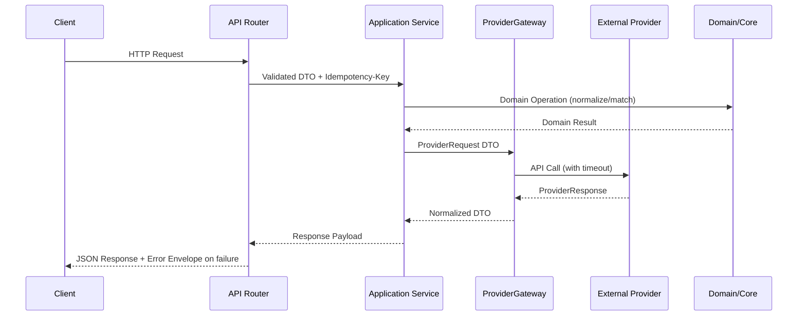

# Architecture Diagrams

## Request Flow


## Orchestrator Flow
```mermaid
flowchart LR
    Scheduler[Scheduler\n(prioritised fetch)] -->|Lease job| Dispatcher[Dispatcher]
    Dispatcher --> Pools{Worker Pools}
    Pools -->|Dispatch| Handler[Job Handler]
    Handler -->|Process| Gateway
    Gateway[ProviderGateway/Services]
    Handler -->|Heartbeat| LeaseStore[(Visibility Store)]
    Handler -->|Ack success| Scheduler
    Handler -->|Fail w/ retry budget| RetryQueue[[Retry Queue]]
    RetryQueue --> Scheduler
    Handler -->|Exhausted budget| DLQ[(Dead Letter Queue)]
    DLQ --> Observability[Structured Logs\n`event=worker_job`]
    LeaseStore -->|Timeout| Scheduler
```
