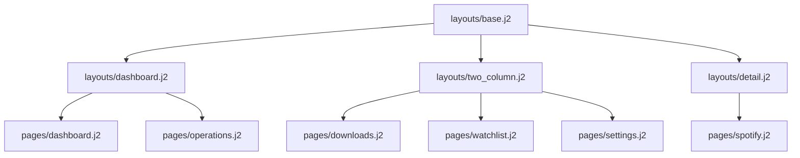

# FastAPI + Jinja2 + HTMX Frontend Plan

## Architektur & Leitplanken

### Zielbild
- Ein serverseitig gerendertes UI unter `/ui` ersetzt fehlende Operator-Tools, ohne bestehende API-Kontrakte zu brechen. FastAPI rendert Jinja2-Templates und liefert HTMX-Fragmente für Teilaktualisierungen.【F:app/ui/routes/downloads.py†L1-L115】
- Der Funktionsumfang deckt Suche, Downloads, Watchlists, Spotify-Verwaltung, Systemeinsicht und Warteschlangen auf Basis der bestehenden REST-Endpunkte unter `/api/v1` sowie `/api/health` ab.【F:app/api/router_registry.py†L37-L223】【F:app/api/health.py†L10-L27】
- Zielnutzer sind interne Operator:innen; Authentisierung nutzt Session- und API-Key-Mechanismen der bestehenden `SecurityConfig`. Keine zusätzliche Frontend-Build-Toolchain oder Client-State-Frameworks.

### Stack-Übersicht
- **Server-Layer:** FastAPI-Router unter `app/ui/routes` orchestrieren Session-Checks, Feature-Flags und Kontextaufbau je Seite. Fehlerpfade werden zentral über `_render_alert_fragment` bzw. strukturierte Logevents gehärtet.【F:app/ui/routes/downloads.py†L28-L115】
- **Template-Layer:** `layouts/base.j2` definiert globale Slots (`head_extras`, `page_header`, `main`, `footer`, `modals`, `scripts`) und kümmert sich um Asset-Bootstrap, Navigation sowie Alert-Regionen.【F:app/ui/templates/layouts/base.j2†L1-L55】
- **Layout-Spezialisierungen:** `layouts/dashboard.j2`, `layouts/two_column.j2` und `layouts/detail.j2` kapseln wiederkehrende Seitenstrukturen inkl. Modals und aria-Rollen.【F:app/ui/templates/layouts/dashboard.j2†L1-L27】【F:app/ui/templates/layouts/two_column.j2†L1-L21】【F:app/ui/templates/layouts/detail.j2†L1-L26】
- **Kontext-Objekte:** Slots-basierte Dataclasses (z. B. `LayoutContext`, `NavigationContext`, `FormDefinition`) liefern stark typisierte Werte für Templates und sichern minimale Speicherfußabdrücke.【F:app/ui/context/base.py†L19-L160】
- **Assets & Interaktion:** HTMX und UI-Bootstrap-Skripte werden zentral geladen; Polling-Intervalle und Ziel-IDs werden pro Fragment vereinbart, wobei `hx-target`-IDs das Schema `hx-<bereich>-<entity>` beibehalten.

### Layout-Vererbung & Beispiel
- Jede Seite im Ordner `templates/pages` erweitert exakt ein Layout und füllt dessen Pflicht-Blöcke (`main` bzw. layout-spezifische Slots). Zusatzmodals werden über `block ..._modals` verdrahtet.
- Fragment-Templates in `templates/partials` liefern HTMX-Antworten, teilen sich jedoch den gleichen Kontextbaum wie ihre aufrufenden Seiten.



### Block- & Namenskonventionen
- Globale Blöcke heißen `head_extras`, `page_header`, `main`, `footer`, `modals`, `scripts`. Layouts führen zusätzliche Slots ein (`dashboard_*`, `sidebar`, `detail_*`).
- `hx-target`-/Element-IDs folgen `hx-<bereich>-<entity>` (z. B. `hx-downloads-table`), `data-test` Attribute spiegeln Identifier aus dem Kontext.
- Template-Dateien nutzen `kebab-case` mit `.j2`-Endung; Seiten werden unter `templates/pages/<slug>.j2` abgelegt, Fragmente unter `templates/partials/<name>.j2`.

### Kontextaufbau & Datenfluss
- Routen erzeugen Kontext-Dictionaries per `build_*_page_context` oder `build_*_fragment_context`. Diese Funktionen kapseln API-Aufrufe, wandeln Domain-Objekte in Template-Dataclasses und liefern `layout`, `page`, `fragment` oder `forms` Schlüssel konsistent aus.【F:app/ui/routes/downloads.py†L28-L115】
- `LayoutContext.page_id` bestimmt Seitentitel, aktive Navigation sowie Berechtigungsprüfungen. Jede neue Seite MUSS einen eindeutigen `page_id` setzen und passende Navigationseinträge liefern.【F:app/ui/context/base.py†L62-L70】
- Feature-Flags und Rollenchecks erfolgen vor dem Rendern; Fragment-Routen spiegeln dieselben Guards, um direkte HTMX-Calls abzusichern.【F:app/ui/routes/downloads.py†L38-L115】

### HTMX-Interaktionsmuster
- Polling-Frequenzen (`hx-trigger="every Ns"`) sind pro Fragment dokumentiert und sollten Logging-Events (`log_event(..., component="ui.fragment.*")`) schreiben, um Observability zu sichern.【F:app/ui/routes/downloads.py†L72-L115】
- Fehlerpfade rendern Alerts über `_render_alert_fragment` und liefern passende HTTP-Statuscodes, damit HTMX das Swapping respektiert.【F:app/ui/routes/downloads.py†L57-L115】
- CSRF-Tokens werden beim ersten Render über `attach_csrf_cookie` gesetzt und in Formular-Fragmente gespiegelt; neue POST/PATCH/DELETE-Fragmente müssen `Depends(enforce_csrf)` nutzen.【F:app/ui/routes/downloads.py†L1-L200】

## Sitemap
```
/ui/login                – API-Key Login-Formular für UI-Session
/ui                      – Dashboard mit Status, Aktivität, Schnellaktionen
/ui/spotify               – Konto-Status, OAuth-Flow, Playlist-Tools & FREE-Ingest
/ui/search                – Aggregierte Suche + Auswahl und Download-Start
/ui/downloads             – Download-Liste, Priorität, Retry, Export
/ui/jobs                  – Orchestrator, DLQ, Metadata-, Sync-Trigger
/ui/watchlist             – Künstler-Watchlist & Prioritäten
/ui/activity              – Aktivitätsfeed & Export
/ui/settings              – Konfigurationsschlüssel, Historie, Präferenzen
/ui/system                – Health, Readiness, Metriken, Secrets-Checks
```

## Geplante UI-Routen
| Methode | Pfad | Zweck | Min Role | Feature Flag |
|---------|------|-------|----------|--------------|
| GET | /ui/login | API-Key Eingabe & Session-Erstellung | — (öffentlich) | — |
| POST | /ui/login | Session erstellen, Weiterleitung Dashboard | — (öffentlich) | — |
| GET | /ui | Einstiegs-Dashboard mit Status-KPIs | read_only | — |
| GET | /ui/spotify | Spotify-Verbindung, OAuth-Flow, Backfill-Panels & FREE-Ingest | operator | `UI_FEATURE_SPOTIFY` (Uploads zusätzlich `UI_FEATURE_IMPORTS`) |
| GET | /ui/search | Suchformular & Ergebnis-Liste | operator | UI_FEATURE_SOULSEEK |
| GET | /ui/downloads | Download-Queue & Verwaltung | operator | UI_FEATURE_DLQ |
| GET | /ui/jobs | Überblick Jobs (Metadata, Sync, DLQ) | operator | UI_FEATURE_DLQ |
| GET | /ui/watchlist | Watchlist-CRUD Oberfläche | operator | — |
| GET | /ui/activity | Aktivitätsverlauf & Exportlinks | read_only | — |
| GET | /ui/settings | Systemeinstellungen & Präferenzen | admin | — |
| GET | /ui/system | System-/Health-Diagnostik, OAuth-Status | operator | — |

## Umsetzung Operator-Seiten (Status)
- ✅ `/ui/operations` bündelt die Async-Fragmente für Downloads, Jobs, Watchlist und Activity. Die Seite pollt die DLQ-Sektionen alle 15 s, die Watchlist alle 30 s und den Activity-Feed alle 60 s über die Routen `/ui/downloads/table`, `/ui/jobs/table`, `/ui/watchlist/table` und `/ui/activity/table` (`hx-get`, `hx-trigger="revealed, every Ns"`, `hx-target` identisch mit den Fragment-IDs).【F:app/ui/templates/pages/operations.j2†L21-L103】【F:app/ui/routes/downloads.py†L57-L127】【F:app/ui/routes/jobs.py†L52-L111】【F:app/ui/routes/watchlist.py†L53-L167】【F:app/ui/routes/activity.py†L50-L117】
- ✅ `/ui/downloads` und `/ui/jobs` sind eigenständige Operator-Ansichten mit `hx-get` Polling (15 s) auf die Tabellen-Fragmente und verlinken zurück zur Operations-Übersicht, Feature-Gate via `UI_FEATURE_DLQ`.【F:app/ui/templates/pages/downloads.j2†L1-L33】【F:app/ui/templates/pages/jobs.j2†L1-L33】【F:app/ui/routes/downloads.py†L28-L55】【F:app/ui/routes/jobs.py†L23-L49】
- ✅ `/ui/watchlist` stellt das Formular für neue Einträge (`hx-post="/ui/watchlist"`, CSRF-Meta) sowie das regelmäßig aktualisierte Tabellenfragment (`hx-trigger="load, every 30s"`).【F:app/ui/templates/pages/watchlist.j2†L1-L49】【F:app/ui/routes/watchlist.py†L29-L200】
- ✅ `/ui/activity` ist für alle Rollen sichtbar (`require_session`) und pollt den Aktivitätsfeed alle 60 s (`hx-get="/ui/activity/table"`).【F:app/ui/templates/pages/activity.j2†L1-L33】【F:app/ui/routes/activity.py†L26-L117】
- Die Navigation markiert auf allen Unterseiten den Operations-Tab als aktiv; Rücksprunglinks zeigen auf `/ui/operations` bzw. `/ui`.【F:app/ui/context/base.py†L391-L447】【F:app/ui/templates/pages/downloads.j2†L11-L18】

## Template-Architektur
```
templates/
  layouts/
    base.j2           – Grundgerüst mit Navigation, Alerts & Script-Bootstrap
    dashboard.j2      – KPI- und Primär/Secondary-Spalten für Startseiten
    two_column.j2     – Sidebar-Layout für Management-Ansichten
    detail.j2         – Fokus-Layout für Detail-/Inspektionsseiten
  pages/
    dashboard.j2
    operations.j2
    downloads.j2
    jobs.j2
    watchlist.j2
    search.j2
    settings.j2
    system.j2
    spotify.j2
    activity.j2
    admin.j2
    login.j2
    soulseek.j2
  partials/
    alerts.j2
    alerts_fragment.j2
    status_badges.j2
    nav.j2
    tables.j2
    downloads_table.j2
    watchlist_table.j2
    activity_table.j2
    dashboard_status.j2
    system_integrations.j2
    settings_form.j2
    _strings.j2
  components/
    layout_blocks.j2  – Makros für KPI-Karten, Sidebar-Sections & Detail-Panels
```

### Layout-Erweiterung in Seiten
```jinja
{# pages/downloads.j2 #}




  {{ layout_blocks.render_sidebar_sections(sidebar_sections, None) }}



  <div id="{{ downloads_fragment.identifier }}"
       hx-get="{{ downloads_fragment.url }}"
       hx-trigger="{{ downloads_fragment.trigger }}"
       hx-target="{{ downloads_fragment.target }}"
       hx-swap="{{ downloads_fragment.swap }}">
    ...
  </div>

```

## Coding-Guidelines für neue UI-Seiten

### Benennung & Struktur
- Neue Seiten liegen unter `templates/pages/<slug>.j2` und spiegeln die Route (`/ui/<slug>`). Verwendet `kebab-case` und importiert benötigte Makros explizit, wie in `pages/downloads.j2` demonstriert.【F:app/ui/templates/pages/downloads.j2†L1-L37】
- Jeder Kontext setzt einen eindeutigen `LayoutContext.page_id`, damit `_strings.page_title` und Navigation korrekt funktionieren.【F:app/ui/context/base.py†L62-L70】【F:app/ui/templates/partials/_strings.j2†L1-L28】

### Layout & Slots
- Seiten müssen exakt ein Layout (`layouts/dashboard.j2`, `two_column.j2`, `detail.j2`) erweitern und dessen Pflicht-Blöcke füllen. Optionale Slots wie `dashboard_secondary` oder `two_column_modal_container` bleiben leer, wenn sie nicht genutzt werden.【F:app/ui/templates/layouts/dashboard.j2†L1-L27】【F:app/ui/templates/layouts/two_column.j2†L1-L21】【F:app/ui/templates/layouts/detail.j2†L1-L26】
- Globale Erweiterungen (`head_extras`, `header_actions`, `modals`, `scripts`) werden nur überschrieben, wenn die Seite zusätzlichen Inhalt benötigt; Basiskomponenten wie Navigation oder Alerts dürfen nicht entfernt werden.【F:app/ui/templates/layouts/base.j2†L1-L55】

### Kontext-Builders & Dataclasses
- Pro Seite existiert ein `build_*_page_context` in `app/ui/context/<feature>.py`, das `LayoutContext`, Fragment-Definitionen und URLs liefert. Diese Funktionen kapseln alle Ableitungen von Domain-Objekten und halten den Rückgabewert als Mapping mit `request`, `layout`, `session` sowie feature-spezifischen Schlüsseln konsistent.【F:app/ui/context/downloads.py†L28-L72】
- Neue Kontext-Dataclasses nutzen `@dataclass(slots=True)` und wohnen in `app/ui/context/base.py`, damit Templates typsichere Attribute und minimale Speicherabdrücke erhalten.【F:app/ui/context/base.py†L19-L160】

### Strings & Texte
- Alle sichtbaren Strings kommen aus `_strings.j2`; neue Keys folgen dem Namensschema `<bereich>.<purpose>` und werden von Makros (`page_title`, `section_heading`, `nav_label`, `form_label`) konsumiert.【F:app/ui/templates/partials/_strings.j2†L1-L83】
- Temporäre Texte in Partials werden ebenfalls zentralisiert; Inline-Strings in Templates gelten als Drift und müssen nachgezogen werden.

### HTMX & Fehlerbehandlung
- HTMX-IDs folgen `hx-<bereich>-<entity>`, Polling-Trigger werden im Kontext hinterlegt (`fragment.trigger`). Fragments liefern bei Fehlern `partials/async_error.j2` über `_render_alert_fragment`, damit Swaps konsistent bleiben.【F:app/ui/context/downloads.py†L75-L120】【F:app/ui/routes/shared.py†L64-L102】
- SSE-/Polling-Modi werden über `_resolve_live_updates_mode` ermittelt; neue Seiten sollen Polling-Intervalle und eventuelle SSE-Quellen über den Kontext konfigurierbar halten.【F:app/ui/routes/shared.py†L20-L47】【F:app/ui/routes/downloads.py†L28-L115】

### Navigation, Feature-Flags & Sicherheit
- Routen validieren Rollen über `require_role` und prüfen Feature-Flags (`session.features.*`) vor jedem Render oder Mutations-Call; Fragment-Endpunkte spiegeln dieselben Guards.【F:app/ui/routes/downloads.py†L28-L115】【F:app/ui/session.py†L96-L179】
- Formulare mit schreibenden Aktionen nutzen `Depends(enforce_csrf)` und geben `csrftoken`-Hidden-Fields zurück. Neue POST/PATCH/DELETE-Aktionen ohne CSRF-Abgleich sind unzulässig.【F:app/ui/routes/downloads.py†L1-L200】

### Observability & Logging
- Jeder Fragment-Handler schreibt strukturierte `log_event`-Einträge mit `component="ui.fragment.<name>"` und `status` (`success`/`error`), damit das Monitoring Polling-Drift erkennt.【F:app/ui/routes/downloads.py†L72-L115】
- Langlaufende Aufgaben (z. B. SSE-Builders) loggen Fehler innerhalb des Builders; neue Hintergrund-Streams müssen denselben Guard respektieren, um das Event-Loop nicht zu blockieren.【F:app/ui/routes/shared.py†L34-L63】

## Internationalisierung & Strings
- Phase 1 liefert ausschließlich englische Texte. Alle UI-Strings liegen in `templates/partials/_strings.j2` und werden über Jinja-Makros eingebunden.
- Ein späterer i18n-Task kann das Makro-Set um Locale-Parameter ergänzen. Bis dahin gelten englische Accessibility-Texte (ARIA-Labels, Tooltips) als Standard.
- Neue Seiten müssen Strings zentral hinterlegen; Inline-Hardcodings sind zu vermeiden.

## HTMX-Kontrakte nach Seite

### Dashboard (/ui)
| Interaktion | API-Aufruf | Trigger | Target & Swap | Fehlerpfad |
|-------------|------------|---------|---------------|------------|
| Statusübersicht | GET `/ui/dashboard/status` → `/api/v1/status` | `load, every 30s` | `#hx-dashboard-status`, `hx-swap="innerHTML"` | `_render_alert_fragment` mit Retry-Schaltfläche【F:app/ui/routes/base.py†L86-L153】 |
| Health-Checks | GET `/ui/dashboard/health` → `/api/health/{live,ready}` | `load, every 60s` | `#hx-dashboard-health`, `hx-swap="innerHTML"` | `_render_alert_fragment`, Logging `ui.fragment.dashboard_health`【F:app/ui/routes/base.py†L156-L215】 |
| Worker-Übersicht | GET `/ui/dashboard/workers` → `/api/v1/status` | `load, every 45s` | `#hx-dashboard-workers`, `hx-swap="innerHTML"` | `_render_alert_fragment` inkl. Retry-Link【F:app/ui/routes/base.py†L218-L273】 |

### Spotify (/ui/spotify)
Die Spotify-Seite bündelt nun Status, OAuth-Flows, Playlist-Verwaltung sowie die FREE-Ingest-Uploads.
| Interaktion | API-Aufruf | Trigger | Target & Swap | Fehlerpfad |
|-------------|------------|---------|---------------|------------|
| Status abrufen | GET `/api/v1/spotify/status` | `load, every 60s` | `#hx-spotify-status`, `innerHTML` | Badge rot bei `status="unauthenticated"`【F:app/api/spotify.py†L113-L162】 |
| OAuth-Start | GET `/api/v1/oauth/start` | Klick auf „Verbinden“ | `hx-push-url` zu Callback-Info, modaler Dialog | 503 ⇒ Inline-Alert (Service nicht verfügbar)【F:app/api/oauth_public.py†L22-L39】 |
| OAuth-Manual-Complete | POST `/api/v1/oauth/manual` | Formular-Submit | `#hx-oauth-manual`, `hx-swap="outerHTML"` | 400/429 ⇒ Formular-Errors rendern |【F:app/api/oauth_public.py†L42-L62】
| Playlist-Liste | GET `/api/v1/spotify/playlists` | Tab-Selektion | `#hx-spotify-playlists`, `innerHTML` (ETag berücksichtigt) | 304 ⇒ Kein Swap |【F:app/api/spotify.py†L173-L196】
| Backfill-Trigger | POST `/api/v1/spotify/backfill/...` (auszudifferenzieren) | Buttons mit `hx-post`, CSRF | `hx-swap-oob` Badge-Update | Fehler-Toast bei 4xx/5xx |
| FREE-Import Upload | POST `/api/v1/imports/free` | Drag&Drop-Form (multipart/text) (nur `operator`+) | `#hx-import-result`, `innerHTML` | 413 ⇒ Fehlerfeld; 200 zeigt akzeptierte/rejecte Links |【F:app/routers/imports_router.py†L34-L140】 |

### Suche & Queue (/ui/search)
| Interaktion | API-Aufruf | Trigger | Target & Swap | Fehlerpfad |
|-------------|------------|---------|---------------|------------|
| Aggregierte Suche | POST `/api/v1/search` | Form Submit (Enter/Click) | `#hx-search-results`, `hx-swap="innerHTML"`, `hx-push-url` für Query | 422/503 ⇒ Fehlerbanner |【F:app/api/search.py†L158-L209】
| Download anfordern | POST `/api/v1/download` | Button in Ergebnisliste (`hx-post`, JSON body) | `hx-swap-oob` Queue-Zähler, Erfolgsmeldung | 400/502 ⇒ Inline-Error |【F:app/routers/download_router.py†L163-L190】
| Soulseek-Suche | POST `/api/v1/soulseek/search` | Tab „Soulseek“ `hx-post` | Fragment `id="hx-search-results"`, `hx-target="#hx-search-results"`, `hx-swap="innerHTML"` | 502 ⇒ Alert |【F:app/routers/soulseek_router.py†L75-L118】

Die HTML-Ansicht `/ui/search` sendet das Formular via `hx-post="/ui/search/results"` und aktualisiert die Download-Queue über `hx-get="/ui/downloads/table"` mit einem Polling-Intervall von 30 Sekunden im Fragment `#hx-search-queue` (`hx-trigger="revealed, every 30s"`). Die Formularsektion enthält Checkboxen für jede konfigurierte Quelle (Standard: Spotify und Soulseek); Pagination-Links führen die `sources`-Parameter mit, damit Filterauswahlen bestehen bleiben.
Der Zugriff auf die Seite setzt mindestens die Rolle `operator` voraus; Sessions mit `read_only`-Rolle erhalten `403 Forbidden`, deaktivierte Soulseek-Features führen zu `404 Not Found`.

### Downloads (/ui/downloads)
| Interaktion | API-Aufruf | Trigger | Target & Swap | Fehlerpfad |
|-------------|------------|---------|---------------|------------|
| Liste laden/paginieren | GET `/api/v1/downloads` | `load`, `hx-trigger="every 15s"`, Paginierungslinks (`hx-get`) | `#hx-downloads-table`, `innerHTML` | 5xx ⇒ Fehlertable mit Retry |【F:app/routers/download_router.py†L45-L118】
| Priorität ändern | PATCH `/api/v1/download/{id}/priority` | Inline-Form (`hx-patch`) | Zeilen-Fragment `hx-swap="outerHTML"` | 409 ⇒ Hinweis-Toast |【F:app/routers/download_router.py†L143-L160】
| Retry & Cancel | POST `/api/v1/download/{id}/retry`, DELETE `/api/v1/download/{id}` | Button `hx-post` / `hx-delete` mit Confirm | Row ersetzt; `hx-swap-oob` für KPIs | Fehler ⇒ Modal mit Details |【F:app/routers/download_router.py†L175-L240】
| Export | GET `/api/v1/downloads/export` | Link (klassisch) → Datei-Download | — | 400 ⇒ Fehlerdialog |【F:app/routers/download_router.py†L192-L223】

### Jobs & Warteschlangen (/ui/jobs)
| Interaktion | API-Aufruf | Trigger | Target & Swap | Fehlerpfad |
|-------------|------------|---------|---------------|------------|
| DLQ Übersicht | GET `/api/v1/dlq` (mit Queryparametern) | `load`, `hx-trigger="every 15s"`, Filter `hx-get` | `#hx-dlq-table` | 503 ⇒ Fehlerhinweis |【F:app/routers/dlq_router.py†L170-L197】
| DLQ Requeue/Purge | POST `/api/v1/dlq/requeue` / `/api/v1/dlq/purge` | Checkbox-Auswahl `hx-post` (nur `admin`) | `hx-swap-oob` Counters, Tabellen-Refresh | Konflikte ⇒ Fehlermeldung |【F:app/routers/dlq_router.py†L200-L239】
| Metadata-Job | POST `/api/v1/metadata/update`, GET `/api/v1/metadata/status`, POST `/api/v1/metadata/stop` | Buttons mit `hx-post`, Polling alle 15s (`stop` nur `admin`) | `#hx-metadata-card` | 503 ⇒ Worker offline Hinweis |【F:app/routers/metadata_router.py†L19-L77】
| Soulseek Queue | GET `/api/v1/downloads` | Tab-Ladevorgang, `hx-trigger="every 30s"` | `#hx-soulseek-downloads` | 5xx ⇒ Fehlerbanner; Kontext siehe `build_soulseek_page_context` (Fragment) & `DownloadsUiService.list_downloads` (Adapter) |【F:app/ui/context/soulseek.py†L180-L249】【F:app/ui/services/downloads.py†L64-L109】
| Soulseek Requeue/Cancel | POST `/api/v1/soulseek/downloads/{id}/requeue`, DELETE `/api/v1/soulseek/download/{id}` | Action-Buttons (nur `admin` für Requeue/Stop) | Zeilen-Update, `hx-swap-oob` Stats | 409/503 ⇒ Toast |【F:app/routers/soulseek_router.py†L635-L719】

### Watchlist (/ui/watchlist)
| Interaktion | API-Aufruf | Trigger | Target & Swap | Fehlerpfad |
|-------------|------------|---------|---------------|------------|
| Einträge laden | GET `/api/v1/watchlist` | `load`, `hx-trigger="every 30s"`, Filter | `#hx-watchlist-table` | 500 ⇒ Fehlerhinweis |【F:app/api/watchlist.py†L56-L84】
| Eintrag hinzufügen | POST `/api/v1/watchlist` | Formular Submit | Tabelle `hx-swap="innerHTML"` + Erfolgstoast | Validierungsfehler inline |【F:app/api/watchlist.py†L87-L127】
| Priorität ändern / Pause / Löschen | PATCH `/api/v1/watchlist/{artist}`, POST `/api/v1/watchlist/{artist}/pause`, POST `/api/v1/watchlist/{artist}/resume`, DELETE `/api/v1/watchlist/{artist}` | Buttons | Zeile `outerHTML` | AppError ⇒ Fehlermeldung |【F:app/api/watchlist.py†L130-L227】

### Aktivität (/ui/activity)
| Interaktion | API-Aufruf | Trigger | Target & Swap | Fehlerpfad |
|-------------|------------|---------|---------------|------------|
| Feed laden | GET `/api/v1/activity` | `load`, `hx-trigger="every 60s"`, Pagination `hx-get` | `#hx-activity-table` | 5xx ⇒ Fehlerbanner |【F:app/routers/activity_router.py†L25-L52】
| Export | GET `/api/v1/activity/export` | Link/Knopf (klassischer Download) | — | 400 ⇒ Inline-Alert |【F:app/routers/activity_router.py†L125-L157】

### Einstellungen (/ui/settings)
| Interaktion | API-Aufruf | Trigger | Target & Swap | Fehlerpfad |
|-------------|------------|---------|---------------|------------|
| Einstellungen anzeigen | GET `/api/v1/settings` | `load` (kein Polling; Admin-only) | Formularfelder `innerHTML` | 5xx ⇒ Fehlerbanner |【F:app/routers/settings_router.py†L39-L53】
| Key/Value speichern | POST `/api/v1/settings` | Submit `hx-post` | `hx-swap-oob` Toast + Aktualisierung | 400 ⇒ Feld-Error |【F:app/routers/settings_router.py†L39-L70】
| Historie laden | GET `/api/v1/settings/history` | Tab `hx-get` | `#hx-settings-history` | — |【F:app/routers/settings_router.py†L83-L101】
| Künstlerpräferenzen | GET/POST `/api/v1/settings/artist-preferences` | Formular mit Mehrfachzeilen | Tabelle `innerHTML` | 400 ⇒ Validierungsfeedback |【F:app/routers/settings_router.py†L103-L151】

### System (/ui/system)
| Interaktion | API-Aufruf | Trigger | Target & Swap | Fehlerpfad |
|-------------|------------|---------|---------------|------------|
| Liveness/Readiness | GET `/api/health/live`, `/api/health/ready` | Buttons/Auto-Check | Ergebnis-Panel | 503 ⇒ Warnhinweis |【F:app/api/health.py†L10-L27】
| Integrationen-Status | GET `/api/v1/integrations` | `load`, Refresh-Button | `#hx-integrations` | Fehler ⇒ Alert |【F:app/routers/integrations.py†L34-L47】
| Secrets-Validierung | POST `/api/v1/secrets/{provider}/validate` | Formular (nur `admin`) | Ergebnis-Karte | Fehlerdetails im Formular |【F:app/api/system.py†L204-L220】
| Metrics-Link | GET `/api/v1/metrics` | Standard-Link (öffnet neuen Tab) | — | 5xx ⇒ Hinweis |
| Spotify/Soulseek Health | GET `/api/v1/health/spotify`, `/api/v1/health/soulseek` | `load`, `hx-trigger="every 60s"` | Badges | Status ≠ ok ⇒ Rot |【F:app/routers/health_router.py†L15-L33】

- ✅ `/ui/system` lädt Liveness-, Readiness- und Integrationskarten als HTMX-Fragmente (`/ui/system/<fragment>`), zeigt Service-Credential-Badges auf Basis von `evaluate_all_service_health` und bietet CSRF-geschützte Secret-Validierung pro Provider (nur `admin`, unabhängig von `UI_FEATURE_IMPORTS`).【F:app/ui/routes/system.py†L33-L200】【F:app/ui/templates/pages/system.j2†L1-L94】

Das Drag&Drop-Panel erscheint innerhalb der Spotify-Seite, sobald `UI_FEATURE_SPOTIFY` aktiv ist; Upload-Aktionen selbst werden zusätzlich von `UI_FEATURE_IMPORTS` gesteuert. Die Dropzone zeigt Dateiname und Uploadstatus in einer `aria-live="polite"`-Region an, verhindert Mehrfachdateien und lässt sich per Tastatur (`Enter`/`Space`) triggern.

### Fehler- und Toast-Behandlung
- `app/ui/static/js/htmx-error-handler.js` registriert einen globalen Listener auf `htmx:responseError`, injiziert HTML-Antworten (`partials/alerts_fragment.j2`/`partials/async_error.j2`) in `[data-role="alert-region"]` und stellt die Funktion `handleHtmxError(event)` für Template-Hooks bereit.
- `app/ui/static/js/polling-controller.js` verfolgt pro Fragment die Fehlversuche, verdoppelt bei wiederholten Fehlern das `hx-trigger`-Intervall bis maximal 5 min und setzt es nach erfolgreichen Antworten zurück.
- Standard: HTTP 4xx/5xx Antworten werden via HTMX `hx-on="htmx:responseError:handleHtmxError(event)"` abgefangen → `partials/alerts.html` rendert Fehlermeldungen.
- Validation (422/400) liefert Partial mit Formular-Fehlermarkierungen.
- `hx-swap-oob` wird für globale Toasts, KPI-Zähler und Badge-Updates genutzt.

## Live-Update-Strategie
- **Standard (Polling)**: Polling über HTMX mit festen Intervallen pro Seite – Dashboard 30 s, Health-Badges 60 s, Downloads & Jobs 15 s, Watchlist 30 s, Activity 60 s. Trigger sind in den obigen Tabellen hinterlegt und werden zentral getestet.
- **Server-Sent Events**: Per `UI_LIVE_UPDATES=SSE` schaltet der Router auf `/ui/events` um. Der Browser initialisiert eine `EventSource`, aktualisiert Downloads-, Jobs-, Watchlist- und Activity-Tabellen ohne zusätzliche HTMX-Requests und fällt bei deaktivierter Option automatisch auf Polling zurück.
- **Backoff & Fehlerhandling**: Wiederholte 5xx-Antworten lösen visuelle Warnungen aus und verdoppeln clientseitig das Polling-Intervall bis max. 5 min. Erfolgreiche Antworten setzen den Timer zurück; umgesetzt via `app/ui/static/js/polling-controller.js`, das in `layouts/base.j2` für alle Seiten geladen wird. SSE-Verbindungen setzen auf automatische Reconnects des Browsers.

## Security & Sessions
- **Login & Session**: `/ui/login` nimmt einen API-Key entgegen, validiert gegen `SecurityConfig` und erzeugt eine serverseitig gespeicherte Session mit API-Key-Fingerprint. Der Client erhält ausschließlich das Cookie `ui_session=<opaque>` (`HttpOnly; Secure; SameSite=Lax`). HTMX-Anfragen nutzen dieselbe Session und benötigen keinen zusätzlichen Header.
- **Session-Storage**: Session-State inkl. Rolle (`read_only|operator|admin`) wird serverseitig persistiert. Standard-Rolle stammt aus `UI_ROLE_DEFAULT`, pro Nutzer überschreibbar via `UI_ROLE_OVERRIDES` (siehe `docs/operations/security.md`).
- **CSRF**: Mutierende Requests (`POST|PATCH|DELETE`) verlangen den Header `X-CSRF-Token`. Ein signiertes Token liegt im Cookie `csrftoken` (`HttpOnly=false`) und wird beim Rendern in `<meta name="csrf-token" content="...">` eingebettet. HTMX setzt `hx-headers='{"X-CSRF-Token": token}'` über ein Startscript.
- **Feature Flags**: Navigation und Routerregistrierung respektieren `UI_FEATURE_*`-Schalter (Standard `true`). Deaktivierte Flags blenden Menüpunkte aus und verhindern Zugriff auf die Route.
- **Rate Limiting & Observability**: UI respektiert bestehende Limits aus `SecurityConfig`; strukturierte Logs erfassen Login-Versuche (ohne API-Key) und CSRF-Fehler.
- **CORS**: keine zusätzlichen Header erforderlich, UI bleibt auf derselben Origin.
- **Content Security Policy**: Basisrichtlinie `default-src 'self'; script-src 'self'; style-src 'self' 'unsafe-inline'; img-src 'self' data:; connect-src 'self';`. Optionales CDN (HTMX via `https://unpkg.com/htmx.org`) ist nur erlaubt, wenn `UI_ALLOW_CDN=true` gesetzt ist; Details in `docs/ui/csp.md`.

## Assets & Static Files
- `/static/css/app.css`: Basis-Styles, Fokus-Indikatoren, Layout (≤20 KB). Optional leichtgewichtiges Framework lokal eingebettet; externe Styles nur wenn `UI_ALLOW_CDN=true` gesetzt ist und SRI nach `docs/ui/csp.md` erfolgt.
- `/static/js/htmx.min.js`: standardmäßig lokal gebündelt (Version mit bekannter Prüfsumme). Bei aktiviertem CDN darf `https://unpkg.com/htmx.org` genutzt werden. Das Fallback-Bundle darf komprimiert (gzip) höchstens 20 KB übertragen, damit das Gesamtbudget von <100 KB für initiales HTML+CSS+JS eingehalten bleibt.
- Iconset: SVG-Sprite unter `/static/icons.svg`.
- Cache-Control: statische Assets `max-age=86400`, `immutable`; HTML ohne Cache; API nutzt bestehende Cache-Header (z. B. Playlist-ETags).【F:app/api/spotify.py†L173-L196】
- Aktivierung per `app.mount("/static", StaticFiles(...))` (neuer Schritt im späteren Task) inklusive Digest-Busting über Query-Parameter.

## Barrierefreiheit
- Fokus-Styles klar sichtbar; Tastaturnavigation via `tabindex` und `aria-keyshortcuts` für kritische Aktionen.
- Landmarks: `<header>`, `<nav role="navigation">`, `<main role="main">`, `<footer>`.
- Tabellen mit `<caption>` und `scope="col"`; sortierbare Spalten nutzen `aria-sort`.
- Live-Regionen (`aria-live="polite"`) für Toasts und Statusaktualisierungen.
- Formulare mit eindeutigen `label for` Beziehungen und Fehlerhinweisen (`aria-describedby`).

## Performance
- Ziel: <100 KB initiales HTML+CSS+JS (komprimiert). HTMX lädt nur benötigte Fragmente.
- Nutzen von `hx-trigger="revealed"` für nachrangige Sektionen (z. B. Historien-Tabellen, Operations-Übersichtstabellen, Search-Queue).
- API-Antworten für Listen pagination (bereits vorhanden) und serverseitig gefiltert (z. B. `limit`, `offset`).【F:app/routers/download_router.py†L45-L73】【F:app/routers/activity_router.py†L25-L52】
- Client-Caching: `ETag`/`Last-Modified` via Playlist-Endpunkte; UI respektiert 304-Responses.【F:app/api/spotify.py†L173-L196】

## Deployment & Port/Binding
- Anwendung bleibt auf `0.0.0.0:8080` gebunden (`DEFAULT_APP_PORT`).【F:app/config.py†L9-L57】
- `/ui`-Routen werden innerhalb des bestehenden FastAPI-App-Objekts registriert; Pfadschema: `/ui[/...]` für HTML, `/api/v1/...` für Daten.
- Healthlinks bleiben `/api/health/live` & `/api/health/ready` für Container-Orchestrierung.【F:app/api/health.py†L10-L27】

## Testplan
- **Smoke**: `httpx.AsyncClient` Tests, die 200er für jede `/ui`-Route prüfen (HTML enthält erwartete Titel).
- **HTMX-Fragmente**: Template-Render-Tests mit `TemplateResponse` + Snapshot der wichtigsten Partials (Downloads-Tabelle, Watchlist-Formulare).
- **API-Contract-Mocks**: Fixtures, die REST-Aufrufe stubben (z. B. Download-Service) und HTML-Responses auf erwartete IDs prüfen.
- **a11y Checks**: `pytest`-Helper, der WAI-ARIA-Rollen & `lang`-Attribut validiert; optional `pa11y` CLI gegen gerenderte Seiten.
- **Performance**: Unit-Test, der CSS/JS Dateigrößen unter Budget hält.
- **Security**: Login-/Logout-Test deckt Session-Cookie (`ui_session`) und CSRF-Header (`X-CSRF-Token`) ab; Rollen-Tests stellen sicher, dass Admin-only Aktionen geblockt werden.

## Migrationsplan
1. **Vorbereitung**: Static-Files-Struktur anlegen, TemplateEngine konfigurieren, CSRF-Middleware ergänzen.
2. **Routing**: neuen Router `ui_router` mit Jinja `TemplateResponse` registrieren; Feature-Flag für schrittweise Aktivierung.
3. **Iteratives Rollout**: Seiten sequentiell implementieren (Dashboard → Downloads → Watchlist …) und jeweils mit API verknüpfen.
4. **Observability**: Strukturierte Logs für `/ui`-Aufrufe (Request-ID, User-Agent) und Metriken (Render-Dauer) hinzufügen.
5. **Docs & Readiness**: README/Operations-Docs um `/ui` erweitern; Deploy-Checklist aktualisieren.
6. **Fallback**: Während Rollout API-first Tools weiter nutzbar lassen; `/ui` kann via Feature-Flag deaktiviert werden.

## Risiken & Gegenmaßnahmen
- **Backend-Placeholder**: Einige Jobs erfordern aktive Worker (Metadata, Sync). Worker-Unverfügbarkeit liefert 503 – UI muss das klar anzeigen.【F:app/routers/metadata_router.py†L19-L86】【F:app/routers/sync_router.py†L26-L106】
- **OAuth Redirect-URI**: Öffentliche Hostnamen müssen mit UI-URL konsistent sein; Dokumentation & Konfiguration prüfen.【F:app/api/oauth_public.py†L22-L83】
- **Soulseek-Stabilität**: Soulseek-Client liefert 502/409-Fehler, UI benötigt robuste Retries & Fehleranzeigen.【F:app/routers/soulseek_router.py†L75-L719】
- **DLQ-Operationen**: Fehlende Worker verhindern Requeue – UI soll gesperrte Aktionen deaktivieren.【F:app/routers/dlq_router.py†L200-L220】
- **Security**: CSRF-Infrastruktur muss eng mit bestehenden Security-Settings verzahnt werden; Tests sichern korrekte Token-Prüfung.

## Entscheidungen (abgeschlossen)
1. **Authentisierung**: `/ui/login` nutzt API-Key Validierung mit serverseitiger Session und Cookie `ui_session`. API-Calls laufen ausschließlich serverseitig; Browser erhält keinen API-Key. CSRF-Token wird via Meta-Tag + Header geführt.
2. **Rollen & Flags**: Rollen `read_only`, `operator`, `admin` werden serverseitig verwaltet. `UI_ROLE_DEFAULT=operator` und optionale `UI_ROLE_OVERRIDES` steuern Nutzerrechte; Feature-Flags (`UI_FEATURE_SPOTIFY`, `UI_FEATURE_SOULSEEK`, `UI_FEATURE_DLQ`, `UI_FEATURE_IMPORTS`) blenden Navigation/Routes aus.
3. **Internationalisierung**: Phase 1 bleibt englisch. Strings leben in `templates/partials/_strings.j2`; i18n-Layer folgt in separatem Task.
4. **Assets & CSP**: Standard ist Self-Hosting unter `/static` mit CSP-Basisrichtlinie. Optionales CDN nur bei `UI_ALLOW_CDN=true` inklusive dokumentiertem SRI (`docs/ui/csp.md`).
5. **Live Updates**: Phase 1 setzt verbindlich auf Polling (15–60 s). Spätere SSE-Unterstützung steht hinter `UI_LIVE_UPDATES` und erfordert keinen zusätzlichen Browsercode vorerst.
