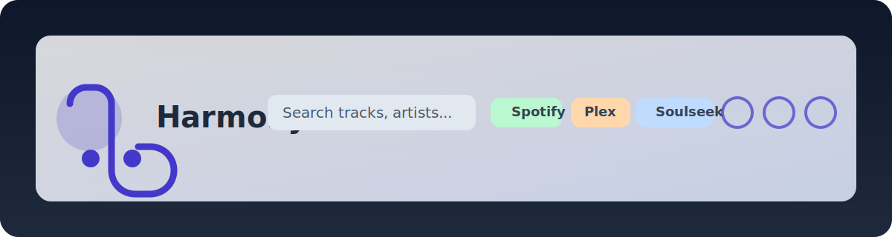

# Harmony Frontend

Die Harmony Web UI ist ein React/Vite-Projekt mit TailwindCSS, shadcn/ui und Radix UI. Die Oberfläche bindet Spotify, Plex und Soulseek an, stellt Matching-Funktionen bereit und erlaubt das Konfigurieren aller Zugangsdaten.

## Installation & Entwicklung

1. In das Frontend-Verzeichnis wechseln

   ```bash
   cd frontend
   ```

2. Abhängigkeiten installieren

   ```bash
   npm install
   ```

3. Entwicklungsserver starten

   ```bash
   npm run dev
   ```

   Der Server läuft auf [http://localhost:5173](http://localhost:5173). Über `VITE_API_BASE_URL` lässt sich bei Bedarf die Backend-URL anpassen (Standard: `http://localhost:8000`).

4. Storybook für UI-Dokumentation

   ```bash
   npm run storybook
   ```

5. Tests ausführen (React Testing Library + Jest)

   ```bash
   npm test
   ```

## Architekturüberblick

```
frontend/
├─ src/
│  ├─ App.tsx                # Router + AppShell
│  ├─ components/            # Layout, Header, Sidebar, UI-Elemente (shadcn/Radix)
│  ├─ hooks/                 # Theme-, Search-, Realtime-Hooks
│  ├─ pages/                 # Feature-Seiten (Dashboard, Spotify, Plex, Soulseek, Matching, Settings)
│  ├─ services/              # Axios-Client + API-Abstraktionen
│  ├─ stories/               # Storybook-Stories
│  └─ __tests__/             # Jest + RTL Tests
├─ index.html
├─ tailwind.config.ts
└─ vite.config.ts
```

Die UI nutzt ein globales `SearchProvider`, um die Header-Suche mit allen Seiten zu teilen. Service-Module kapseln REST- und SSE-Endpunkte (Axios + EventSource). Das Theme wird via `useTheme` Hook persistent in `localStorage` verwaltet.

## Hauptseiten & Funktionen

- **Dashboard** – Systeminformationen (Backend-Version, Datenbank- und Worker-Status, Uptime), Service-Statuskarten für Spotify/Plex/Soulseek/Beets sowie eine Jobs- und Download-Tabelle im Stil der Design-Referenz.
- **Spotify** – Tabs für *Status & Playlists* sowie *Einstellungen*. Globale Suche filtert Playlists und Track-Tabellen, Statuskarten zeigen Verbindungs- und Sync-Informationen.
- **Plex** – Tab-basierte Bibliotheksübersicht mit Artist-, Album- und Track-Tabellen sowie einer Settings-Ansicht für Base-URL, Token und Library.
- **Soulseek** – Download- und Such-Tabellen inklusive Fortschrittsbalken, Abbruch-Buttons und separater Einstellungs-Tab für SLSKD-URL/API-Key.
- **Beets** – Platzhalterseite für die kommende Beets-Integration (Navigation & Layout vorbereitet).
- **Matching** – Startet Spotify→Plex und Spotify→Soulseek Abgleiche, zeigt Ergebnisse tabellarisch und triggert Toast-Notifications.
- **Settings** – Globale Übersicht aller gespeicherten Zugangsdaten, eingebettet in das AppShell-Layout.

## Konfiguration

Die Seiten **Spotify**, **Plex** und **Soulseek** besitzen jeweils einen Einstellungen-Tab. Beim Öffnen werden die aktuellen Werte über `GET /settings` geladen, in den Formularfeldern angezeigt und lassen sich per `POST /settings` aktualisieren. Erfolgreiche Saves triggern einen ✅-Toast, Fehler blenden eine Warnung innerhalb des Formulars ein.

## UI-Komponenten

### AppHeader

- Zentraler Header mit Logo, globaler Suche, Filter-Toggles (Spotify/Plex/Soulseek), Refresh, Notifications, What's-New und Theme Toggle.
- Mobile Nutzer:innen öffnen die Navigation per Drawer-Trigger; Desktop zeigt die Sidebar permanent.
- Storybook-Szenarien: Default, Filter aktiv, Loading, Dark Mode, What's New.



### Weitere Elemente

- **Layout & Sidebar** – Radix Drawer für Mobile, fixe Sidebar auf Desktop (inkl. zusätzlichem Beets-Menüpunkt entsprechend dem Referenzdesign).
- **Toasts** – Globale Benachrichtigungen über Radix Toasts (`useToast`).
- **Progress/Badges** – Tailwind-basierte Komponenten für Soulseek-Downloads und Spotify-Metadaten.

## Tests

- React Testing Library deckt AppHeader-Interaktionen, globale Theme-Umschaltung und den initialen Dashboard-Load ab.
- Services werden in Tests gemockt, um API-Aufrufe zu verifizieren.

Ausführung:

```bash
npm test
```

## Weitere Arbeiten

- Zusätzliche Tabellen- und Filterlogik für große Datenmengen optimieren.
- High-Contrast-Theme evaluieren.
- Backend-Endpoints für Notifications erweitern.
